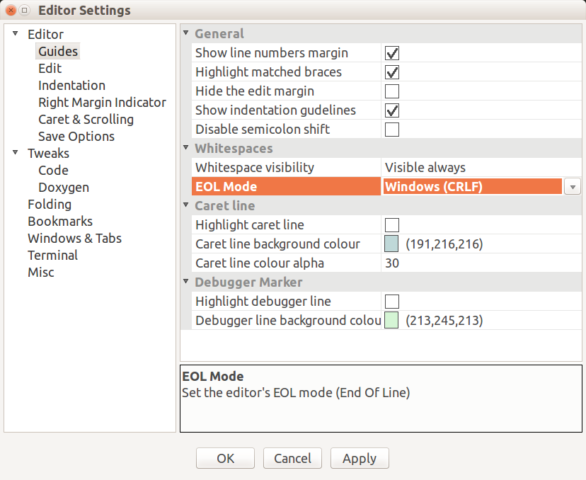

# FreeCAD coding style

### encoding and spaces

- end of line (EOL): using windows style `\r\n`
  set in git and your IDE tool, 


 

Not tested shell script, only if all EOL is `\n`:
```
# remove carriage return
sed -i 's/\r//' CRLF.txt

# add carriage return
sed -i 's/$/\r/' LF.txt
```
It is worth of print before substite: ``

- source code encoding "utf8": defaultl for most IDE

- indentation, never use TAB, but 4 spaces

- remove trailing whitespace:
search by: `find ./*.cpp -type f -exec egrep -l " +$" {} \;`
search before you replace all, some file needs trailing whitespaces, print `sed -n /[[:blank:]]*$/p file.cpp`
substitue with: `sed 's/[[:blank:]]*$//' file.cpp`

- no trailing spaces at end coding: 
search by command``

- limitation of max char in one line: 
  make it easy to read without scrollbar, 80-90 is recommened.

- doxygen in source documentation


### tools for code review

- cppcheck
- compiler's worning

## Qt style C++ coding style

Generaly, the C++ coding style is similar with Qt
<http://qt-project.org/wiki/Qt_Coding_Style>

for example
```
StdCmdExport::StdCmdExport()
    : Command("Std_Export")
{
     // seting the
     sGroup        = QT_TR_NOOP("File");
     sMenuText     = QT_TR_NOOP("&Export...");
     sToolTipText  = QT_TR_NOOP("Export an object in the active document");
     sWhatsThis    = "Std_Export";
     sStatusTip    = QT_TR_NOOP("Export an object in the active document");
     //sPixmap       = "Open";
     sAccel        = "Ctrl+E";
     eType         = 0;
 }
```

type prefix for function parameter is not as useful as for member Variable,

* i: integer
* s: char const*, std::string
* p for pointer (and pp for pointer to pointer)
* pc: pointer of C++ class
* py:  pointer of Python object
* _privateMember

for example: `App::DocumentObject *pcFeat`

It is more Coin3D style,except  "So" namspace suffix is not used. In 2003, C++ compilers are not so powerful and standardised to support even template and namespace in a cross-platform way. visual c++ was really bad to surport C++ standard for some time.

- Namespace is enforced for each module, using "<ModuleName>Export "
- class name (CamelClass) , Acronyms are camel-cased like 'XmlWriter'
- private members:
- member function name (begins with lowerCase). 
- no tab  but 4 spaces indentation

### Fifference from Qt style

- getPropertyName() is used in FreeCAD, while propertyName() is used in Qt, 
- function parameter has the pattern "a single char for type"+"meaningful name"
> commont type char: s->string; i->int; h->Base::Reference/object handle; e->enum; f->float/double; p->pointer; 
- c++ STL and boost lib is used, but higher level Qt style API provided for user


***********************************************************************************

## Python coding style 

### [Disccusion on Python coding standard](http://forum.freecadweb.org/viewtopic.php?f=18&t=12833&p=103832#p103832)

**if API will be exposed to other user,  QtSide coding style should be adapted as possible**

python standard coding style could be used internally.

property name start with upppercase, e.g. 
[src/Mod/TemplatePyMod/DocumentObject.py]

PythonCommand class name
exportable class should follow NamingConvention  doSomthing()
```
Command<SpecificName>
ViewProvider<>
<>TaskPanel
_PrivateClassName
```

### style checker

PyCXX (Py::Object) should be used as possible, it may give better python2.x and python 3.x compability over the raw C API in <Python.h>

return PyObject* and Py::Object has same effect?

pep8 and pyflake to check coding style: sudo apt-get install python3-flake8 flake8
`flake8 --ignore E265,E402,E501,E266 yourfile.py`

<https://github.com/google/yapf>

Python IDE would suggest confliction with flake8 and avoid trailing spaces in c++ IDE

***********************************************

## Inconsistent of naming

[src/Mod/Part/JoinFeatures.py]
`obj.Mode = ['bypass','Connect','Embed','Cutout'] // bypass should be upcase ?`

[src/Mod/Part/App/TopoShape.h]
`static void convertTogpTrsf(const Base::Matrix4D& mtrx, gp_Trsf& trsf);`

### Inconsistent API for getter 
```
Gui::Application::Instance
Gui::MainWindow::getInstance();
Gui::getMainWindow();
```
